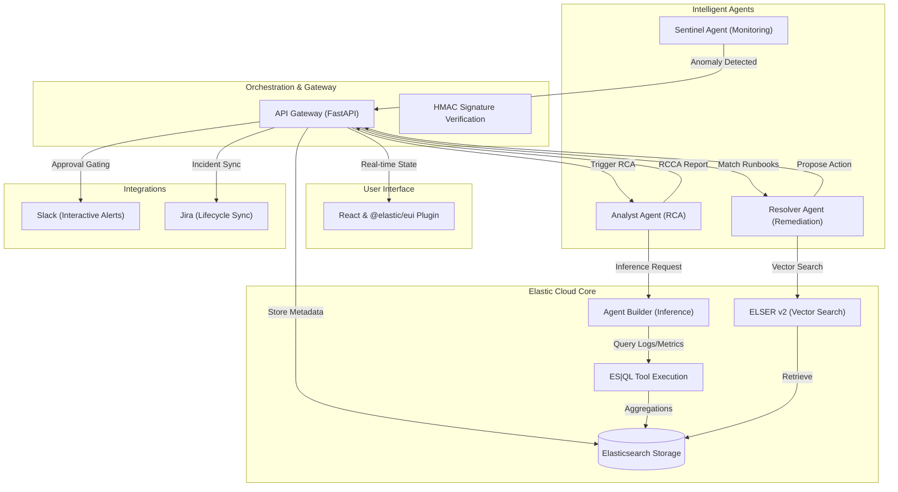

# DataPulse: AI-Driven Autonomous Incident Response

[](https://python.org)
[](https://fastapi.tiangolo.com)
[](https://reactjs.org)
[](https://www.elastic.co/)
[](https://docker.com)

**DataPulse** is a next-generation "Human-in-the-Loop" incident response platform built for the **Elastic Hackathon**. It leverages the **Elastic Agent Builder**, **ES|QL**, and **Semantic Search** to transform raw logs into actionable remediation strategies autonomously.


https://github.com/user-attachments/assets/514958f9-fac0-499f-921e-061b939ce70b


---

## Key Features

- **Autonomous Investigation:** Uses Elastic's Agent Builder to conduct deep RCA (Root Cause Analysis) using real tool calls (logs, metrics, and traces).
- **Remediation Strategies:** A specialized "Resolver" agent suggests actions (Rollbacks, Scaling, Config changes) based on observed failures.
- **Multi-Channel Orchestration:** Bi-directional sync with **Slack** and **Jira**. Approve production changes directly from Slack buttons.
- **SRE Command Center:** A premium Kibana-integrated UI featuring real-time incident tracking, agent "thought logs," and personalized operational impact metrics.
- **Security-First:** HMAC-verified Slack webhooks, RBAC visibility, and session management integrated out of the box.

---

## Technical Architecture



DataPulse is built on a distributed agent architecture:

1.  **Sentinel (Detector):** High-frequency log analysis to detect anomalies.
2.  **API Gateway (Orchestrator):** The central nervous system handling ES persistence and agent routing.
3.  **Analyst Agent (The Brain):** Leverages **Agent Builder** to query ES|QL and synthesize the root cause.
4.  **Resolver Agent (The Fixer):** Connects RCA findings to runbook-based resolutions via **Semantic Search (ELSER)**.
5.  **MCP Adapters:** Standardized connectors for third-party SaaS (Slack, Jira).

---

## Tech Stack

- **Inference & AI:** Elastic Agent Builder, ES|QL, ELSER v2.
- **Backend:** Python 3.10+, FastAPI, Loguru, Pydantic, Httpx.
- **Frontend:** React, `@elastic/eui` (Elastic UI), LocalStorage persistence.
- **Storage:** Elasticsearch 8.17+ (ILM, Search Templates, Vector Search).
- **Infrastructure:** Docker Compose, Bash automation.

---

## Quick Start

```bash
# 1. Setup Environment
cp .env.example .env

# 2. Start the DataPulse stack
docker-compose up -d

# 3. Initialize Elasticsearch Indices
./scripts/setup_elasticsearch_indices.sh

# 4. Generate Synthetic Trailing Logs
python data/generator/generate_data.py
```

Visit the UI at `http://localhost:3000` (or within your Kibana custom app frame).

---

## Documentation

For full setup guides, agent configuration, and integration tutorials, see:
**[FULL DOCUMENTATION GUIDE](./docs/FULL_DOCUMENTATION.md)**

---

## Roadmap

- [ ] RAG-based runbook generation.
- [ ] Adaptive agent personality based on user trust score.
- [ ] Multi-region incident correlation.

*Built for the Elastic Hackathon 2026.*

